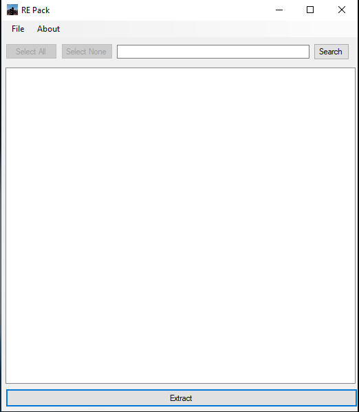

# RE-PAK
UI Based Tool that allows for Previewing (PC)Textures on the fly, Extracting Paks, and Creating PAKs AND modding other platforms(PS4)

# Notes Before You Get Started
* For PAK Creation you do need the orginal PAKs extracted from the platform you intend to create them for(PC => PC, PS4 => PS4) **They Are Not Substitutable With Different Platform PAKS SO DO NOT TRY AND MIX THEM**
* Mods that replace DLC Outfits will not work on the PS4 from my testing, so make sure you read the mod page.
* Example PAKs can be found in this repo, thier credits will be inside the zip in a text document or posted below

# Requirements
* Extracted Game PC/PS4
* [PS4-RE-TEX](https://github.com/Backporter/PS4-RE-TEX) - For PS4 Textures.

# Using PAK Creator
Open the PAK Creatior select open/save, pick the orginal paks from the game, click Create and it will create it, place the two generated paks in the game with the currect name, and it should load as shown below.

# [Video Tutorial](https://youtu.be/RUMiRqHjaqg)

# Proof Of It Working:

# Textures:
Mod: "Blue Gun" - personal mod

PC => 

PS4 => 

# Meshes:
Mod: "Krypton Nanotech Suit" - https://www.nexusmods.com/residentevil22019/mods/599? created by Wiwilz

PS4 => 

Mod: "Leon RE4 Hair" https://www.nexusmods.com/residentevil22019/mods/621? created by Stevebg23 and thier friends JP and ManGaKa 

PS4 => 

# Other Stuff:

RE3 Mods Running on the PS4:

Mod: "Reika" https://www.nexusmods.com/residentevil32020/mods/324 created by ES47_also_known_ as_Dedraz

PS4 => 

# Change Log:

1.0 Base.

2.0 Added PAK Creation and other options.

3.0 Fixed a few bugs

4.0 Small un-notable changes

5.0 Changed the way the Paks are created, Optomised data storing of Pak info this will speed pak creating up a bit.

5.1 Removed the need for a database, the program will automaticly generate it and use it, fixed a bug that would cause an exception if the user didn't provide a proper path for  the hash list.

5.2 Changed the Previewer to support all Tex's

# Screenshots of the App:

